# P4 — Resume Coach: Data-Driven Resume Failure Analysis Pipeline

> Generates 250 synthetic resumes across 5 fit levels, labels them for 5 failure modes, and proves via A/B testing (χ²=32.74, p<0.001) that writing template choice accounts for a 66-percentage-point difference in failure rates.


<p align="center">
  
</p>

**Project 4 of 9** · [AI/ML Engineering Portfolio](../README.md) · Built in 3 days · ~2,500 src · 532 tests · 5 ADRs

## Problem Statement

Job seekers frequently submit resumes with subtle but disqualifying flaws: skills that don't match the job description, experience level mismatches, hallucinated credentials, or awkward AI-generated language. Traditional resume advice is generic and untestable. This project builds a production-grade pipeline that generates controlled synthetic resume data, applies deterministic failure labeling (zero LLM calls, ~250ms for 250 pairs), validates labels with a GPT-4o judge, and runs a statistically rigorous A/B test across 5 writing templates — producing quantified, actionable evidence about what causes resumes to fail.

## Architecture

```mermaid
graph LR
    A[run_generation.py<br/>50 jobs × 5 fit levels<br/>= 250 resumes] --> B[run_labeling.py<br/>5 failure mode flags<br/>Jaccard similarity]
    B --> C[judge.py<br/>GPT-4o evaluation<br/>quality score 0–1]
    C --> D[corrector.py<br/>Instructor retry loop<br/>8/8 corrected]
    D --> E[analyzer.py<br/>9 charts<br/>pipeline_summary.json]
    E --> F[multi_hop.py<br/>4 reasoning questions<br/>per pair]
    F --> G[vector_store.py<br/>ChromaDB<br/>all-MiniLM-L6-v2]
    G --> H[api.py<br/>FastAPI<br/>9 endpoints]
    H --> I[streamlit_app.py<br/>5-page demo]
```



Each module reads from `data/` JSONL files and writes its output back to the same directory — clean, auditable, resumable at any stage. `DataStore` (in `data_paths.py`) loads all artifacts once at API/Streamlit startup for O(1) lookups.

## Key Results

| Metric | Value |
|--------|-------|
| Resumes generated | 250 (100% Pydantic validation rate) |
| Jaccard gradient | excellent=0.669 → good=0.607 → partial=0.620 → poor=0.212 → mismatch=0.005 |
| Awkward language rate | 58.4% |
| Missing core skills rate | 50.8% |
| GPT-4o judge avg quality score | 0.541 |
| Correction rate | 8/8 = 100% |
| A/B χ² statistic | 32.74 (df=4, p=1.35e-06) |
| Best template | `casual` — 34% failure rate |
| Worst template | `career_changer` — 100% failure rate |

Skill overlap (Jaccard similarity) forms a near-perfect gradient across fit levels, confirming it is the dominant signal for resume quality. The A/B template test revealed a statistically significant 66-percentage-point spread between best and worst templates — actionable evidence that template choice matters more than content for reducing failures.

<p align="center">
  
</p>

The Jaccard gradient from excellent (0.669) to mismatch (0.005) validates the entire labeling system — skill overlap is the dominant signal for resume fit.

<p align="center">
  
</p>

A/B test across 5 writing templates: `casual` achieves 34% failure rate while `career_changer` hits 100% — a statistically significant 66-percentage-point spread (χ²=32.74, p<0.001).

<p align="center">
  
</p>

Agreement between the GPT-4o judge and the deterministic rule-based labeler validates automation: the two systems agree closely enough to use the labeler as a low-cost proxy during development.

## Technical Highlights

**Instructor + Nested Schema Generation ([ADR-001](docs/adr/ADR-001-instructor-nested-schemas.md))** — 250 resumes with 4 levels of Pydantic nesting (`Resume → ContactInfo, Skill[], Experience[], Education[]`) generated at 100% validation rate. Instructor's `max_retries=5` with automatic `ValidationError` injection turns blind retries into targeted fixes: the model sees exactly which of ~30 validation points failed. This eliminated ~100 lines of retry state machine per generation function. The same Instructor pattern from P1's flat 7-field schema scaled unchanged to P4's 35-model nested schema.

**Two-Phase Validation ([ADR-003](docs/adr/ADR-003-two-phase-validation.md))** — Structural validation (Instructor/Pydantic at generation time) is separated from semantic validation (labeler post-generation). The labeler is pure Python with zero LLM calls — deterministic, ~250ms for 250 pairs, and fully unit-testable with constructed fixtures. GPT-4o judge is optional Phase 3, controlled by `--skip-judge`. Mixing both layers into one would make testing expensive and debugging hard.

**Skill Normalization ([ADR-002](docs/adr/ADR-002-skill-normalization.md))** — Custom 4-stage pipeline: lowercase → version stripping (`"Python 3.11"` → `"python"`) → suffix removal → alias resolution (`"ML"` → `"machine learning"`). Without this normalizer, `"Python 3.11"` vs `"Python"` scores Jaccard=0.0. The entire gradient from excellent=0.669 to mismatch=0.005 depends on canonicalization. A Day 1.5 audit discovered skills were being generated as full sentences instead of tokens — the pipeline "succeeded" but Jaccard was near zero. Schema-level field descriptions and prompt-level format rules fixed the root cause.

**ChromaDB Vector Store ([ADR-005](docs/adr/ADR-005-chromadb-over-faiss.md))** — `all-MiniLM-L6-v2` embeddings (384d) for 250 resumes, persisted to `data/chromadb/`. A module-level `_ef` singleton avoids a 2s model reload per query. `where={"fit_level": ...}` metadata filtering narrows semantic search by fit tier. ChromaDB was chosen over P2's FAISS specifically for persistence and live API use — same embedding model, different infrastructure requirement.

**FastAPI with Pydantic ([ADR-004](docs/adr/ADR-004-fastapi-over-flask.md))** — All 14 request/response schemas defined in `schemas.py` are reused directly as FastAPI endpoint parameters and `response_model` annotations, with no duplication. `Annotated[int, Query(ge=1, le=50)]` handles inline constraint validation on query parameters. Auto-generates Swagger UI at `/docs` with zero additional code.

## API Endpoints

All endpoints are typed with Pydantic v2 request/response models. Interactive Swagger documentation at `/docs`.

| # | Method | Path | Description |
|---|--------|------|-------------|
| 1 | GET | `/health` | Status, version, data counts, vector store readiness |
| 2 | POST | `/review-resume` | Label a resume against a job description; optional LLM judge |
| 3 | GET | `/analysis/failure-rates` | Failure mode rates from the last pipeline run |
| 4 | GET | `/analysis/template-comparison` | A/B test results across 5 writing templates |
| 5 | POST | `/evaluate/multi-hop` | Generate 4 multi-hop reasoning questions for a resume/job pair |
| 6 | GET | `/search/similar-candidates` | Semantic search over 250 indexed resumes |
| 7 | POST | `/feedback` | Submit human feedback (rating + comment) for a pair |
| 8 | GET | `/jobs` | Paginated, filterable job listing (industry, niche) |
| 9 | GET | `/pairs/{pair_id}` | Full detail: resume + job + labels + judge + corrections + feedback |

## Setup

### Quick Start (30 seconds)

```bash
git clone https://github.com/rubsj/ai-portfolio.git && cd ai-portfolio/04-resume-coach
uv sync && cp .env.example .env  # Add your OPENAI_API_KEY
uv run python -m src.pipeline --dry-run --skip-judge  # ~$0.05, ~2 min
uv run uvicorn src.api:app --reload  # Visit localhost:8000/docs
```

### Prerequisites

- Python 3.12+
- `uv` package manager
- OpenAI API key

### Install

```bash
cd 04-resume-coach
uv sync
cp .env.example .env
# Edit .env — add your OPENAI_API_KEY
```

### Run the full pipeline

```bash
# Full run: ~$0.50 in API costs, ~5–10 minutes
uv run python -m src.pipeline

# Skip generation if data already exists:
uv run python -m src.pipeline --skip-generation --skip-judge

# Dry run (2 jobs × 5 resumes = 10 pairs, ~$0.05):
uv run python -m src.pipeline --dry-run --skip-judge
```

### Start the API

```bash
uv run uvicorn src.api:app --reload
# Visit http://localhost:8000/docs
```

### Start the Streamlit demo

```bash
uv run streamlit run streamlit_app.py
# Opens http://localhost:8501
```

### Run tests

```bash
uv run pytest tests/ -v
uv run ruff check src/ tests/ streamlit_app.py
```

## File Structure

```
04-resume-coach/
├── src/
│   ├── schemas.py          # 35 Pydantic models — the backbone of the entire pipeline
│   ├── templates.py        # 5 resume writing style templates
│   ├── generator.py        # Resume + job generation via Instructor
│   ├── validator.py        # Pydantic structural validation
│   ├── labeler.py          # Pure Python, zero LLM calls — 250 pairs in ~250ms
│   ├── normalizer.py       # SkillNormalizer (4-stage: lower → version → suffix → alias)
│   ├── judge.py            # GPT-4o evaluation with structured output
│   ├── corrector.py        # Correction loop via Instructor
│   ├── analyzer.py         # 9 charts + pipeline_summary.json
│   ├── multi_hop.py        # Multi-hop reasoning question generation
│   ├── vector_store.py     # ChromaDB index: build, query, search
│   ├── data_paths.py       # Centralized file discovery + DataStore loader
│   ├── api.py              # 9 endpoints, 14 request/response schemas, auto-generated Swagger
│   ├── pipeline.py         # End-to-end orchestrator
│   ├── run_generation.py   # CLI entrypoint for generation
│   └── run_labeling.py     # CLI entrypoint for labeling
├── tests/
│   ├── test_schemas.py
│   ├── test_labeler.py
│   ├── test_api.py         # 26 tests, TestClient, fully mocked
│   └── ...
├── streamlit_app.py        # 5-page interactive demo
├── data/
│   ├── generated/          # jobs.jsonl, resumes.jsonl, pairs.jsonl
│   ├── labeled/            # failure_labels.jsonl
│   ├── judge/              # judge_results.jsonl
│   ├── corrected/          # correction_results.jsonl
│   ├── multi_hop/          # multi_hop_questions.jsonl
│   ├── chromadb/           # Persisted ChromaDB vector index
│   └── feedback/           # feedback.jsonl (API + Streamlit submissions)
├── results/
│   ├── charts/             # 9 PNG charts
│   └── pipeline_summary.json
├── docs/
│   ├── adr/                # ADR-001 through ADR-005
│   └── screenshots/        # Streamlit app screenshots
└── pyproject.toml
```

## ADRs

Every significant technical decision is documented with context, alternatives considered, quantified consequences, and Java/TypeScript parallels for cross-stack readability.

| ADR | Decision |
|-----|----------|
| [ADR-001](docs/adr/ADR-001-instructor-nested-schemas.md) | Instructor with max_retries=5 for nested schema generation |
| [ADR-002](docs/adr/ADR-002-skill-normalization.md) | Custom SkillNormalizer over third-party libraries |
| [ADR-003](docs/adr/ADR-003-two-phase-validation.md) | Two-phase validation: structural (Instructor) vs semantic (labeler) |
| [ADR-004](docs/adr/ADR-004-fastapi-over-flask.md) | FastAPI over Flask for the REST API |
| [ADR-005](docs/adr/ADR-005-chromadb-over-faiss.md) | ChromaDB over FAISS for vector search |

## Engineering Practices

**Testing**: 532 tests (pytest), ~95% coverage. All labeler tests are fully deterministic with constructed fixtures — zero LLM mocking. API tests use FastAPI `TestClient` (equivalent to Spring MockMvc). Coverage ceiling is `api.py:52-53` (startup exception branch), which requires module reload to hit.

**Validation**: Two-phase architecture separates structural validation (Instructor/Pydantic at generation time) from semantic validation (rule-based labeler post-generation). The labeler runs 250 pairs in ~250ms at $0.00 cost — tests run in seconds without any mocking infrastructure.

**Data Quality**: A Day 1.5 audit discovered near-zero Jaccard overlap caused by skills generated as full sentences instead of individual tokens. The pipeline's success count looked fine; only inspecting the actual JSONL output revealed the problem. Fix: schema-level `Field(description=...)` constraints plus prompt-level format rules.

**Cross-Project Patterns**: Instructor (P1→P4), SentenceTransformer lifecycle management (P2→P4), Pydantic v2 schema design (P1→P4), ADR documentation (P1→P4). Each project reuses and extends patterns from prior work rather than reinventing infrastructure.

## Cost

Full pipeline run: ~$0.50 (250 resumes + 250 GPT-4o judge evaluations + corrections). Dry run: ~$0.05 (10 pairs, no judge). ChromaDB embedding and all labeling: $0.00.

## Key Insights

1. **Skill normalization is foundational, not optional** — Without the 4-stage normalizer, `"Python 3.11"` vs `"Python"` scores Jaccard=0.0. The entire gradient from excellent=0.669 to mismatch=0.005 depends on canonicalization. Normalization is also where the Day 1.5 data audit paid off: the bug was invisible at the pipeline level.

2. **Template choice matters more than content for failure rates** — A/B testing proved `casual` (34%) vs `career_changer` (100%) with χ²=32.74, p<0.001. This is actionable: fix the template before optimizing the content it generates.

3. **Separate structural from semantic validation** — Instructor handles "is it valid JSON with the right fields?" at generation time. The labeler handles "does the content make sense?" post-generation. Mixing both layers makes testing expensive and debugging ambiguous.

4. **Aggregate metrics can hide fundamental data issues** — The generation pipeline reported 250/250 successes on Day 1. Only a manual audit of actual JSONL output revealed skills were full sentences instead of tokens, causing near-zero Jaccard globally. Always inspect actual output files, not just success counts.

5. **Choose vector stores by deployment context, not benchmarks** — FAISS for P2's batch evaluation (in-memory speed, determinism). ChromaDB for P4's live API (persistence across restarts, metadata filtering). Same `all-MiniLM-L6-v2` embedding model; different operational requirements.

## Demo

📹 2-minute walkthrough (coming in Week 8) — pipeline execution → API testing → Streamlit demo

---

**Part of [AI Portfolio Sprint](../README.md)** — 9 projects in 8 weeks demonstrating production AI/ML engineering.

Built by **Ruby Jha** · [LinkedIn](https://linkedin.com/in/jharuby) · [GitHub](https://github.com/rubsj/ai-portfolio)
