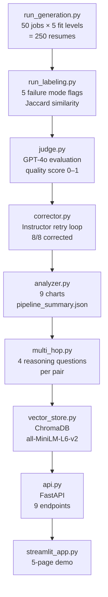

# P4: Resume Failure Analysis Pipeline

I generated 250 synthetic resumes across 5 fit levels, labeled them for 5 failure modes with zero LLM calls, and found that writing template choice accounts for a 66-percentage-point difference in failure rates (χ²=32.74, p<0.001). This is how I got there.

Part of a 9-project portfolio built in 8 weeks. 5 ADRs, 532 tests, 9 analysis charts.


**Live Dashboard:** Deploying in Week 8 of the portfolio sprint. Link will be added here.

<p align="center">
  
</p>

## Results

| Metric | Value |
|--------|-------|
| Jaccard gradient | excellent=0.669 → good=0.607 → partial=0.620 → poor=0.212 → mismatch=0.005 |
| A/B χ² statistic | 32.74 (df=4, p=1.35e-06) |
| Best template | `casual` at 34% failure rate |
| Worst template | `career_changer` at 100% failure rate |
| Awkward language rate | 58.4% |
| Missing core skills rate | 50.8% |
| GPT-4o judge avg quality | 0.541 |
| Correction rate | 8/8 via Instructor retry |

Sample pipeline output: [`results/pipeline_summary.json`](results/pipeline_summary.json) · Sample labeled data: [`data/labeled/failure_labels.jsonl`](data/labeled/failure_labels.jsonl)

## Findings

Skill overlap (Jaccard similarity) forms a clean gradient across fit levels: excellent=0.669 down to mismatch=0.005. This confirms Jaccard is the dominant signal for resume quality.

<p align="center">
  
</p>

`casual` at 34% failure versus `career_changer` at 100%.

<p align="center">
  
</p>

The GPT-4o judge and the deterministic labeler agree closely enough that the labeler works as a low-cost proxy during development.

<p align="center">
  
</p>

### What the numbers mean

**Skill normalization is foundational.** Without the 4-stage normalizer, `"Python 3.11"` vs `"Python"` scores Jaccard=0.0. The entire gradient depends on canonicalization. A Day 1.5 audit found skills were being generated as full sentences instead of tokens. The pipeline reported 250/250 successes. Only inspecting actual JSONL output revealed near-zero Jaccard globally. Fix: schema-level `Field(description=...)` constraints plus prompt-level format rules.

**Template choice matters more than content.** `casual` (34%) vs `career_changer` (100%). Fix the template before optimizing the content it generates.

**Always manually sample your LLM judge.** The judge scored 0.541 average. I haven't investigated whether that reflects genuine resume quality or judge calibration problems. Comparing against human ratings would clarify.

## Architecture



Each module reads from `data/` JSONL files and writes output back to the same directory. Resumable at any stage. `DataStore` (in `data_paths.py`) loads all artifacts once at startup for O(1) lookups.

### Design decisions

| ADR | Decision | Why |
|-----|----------|-----|
| [ADR-001](docs/adr/ADR-001-instructor-nested-schemas.md) | Instructor with max_retries=5 for nested schemas | ValidationError injection so the model fixes the exact failing constraint. Eliminated ~100 lines of retry state machine. |
| [ADR-002](docs/adr/ADR-002-skill-normalization.md) | Custom SkillNormalizer over third-party libraries | 4-stage pipeline: lowercase → version stripping → suffix removal → alias resolution. Without it, Jaccard scores 0.0 on version-suffixed skills. |
| [ADR-003](docs/adr/ADR-003-two-phase-validation.md) | Two-phase validation: structural vs semantic | Structural at generation time, semantic post-generation. Keeps the labeler fully unit-testable with no mocking. |
| [ADR-004](docs/adr/ADR-004-fastapi-over-flask.md) | FastAPI over Flask | Pydantic schemas reused directly as endpoint types. Auto-generates Swagger at /docs. |
| [ADR-005](docs/adr/ADR-005-chromadb-over-faiss.md) | ChromaDB over FAISS | P4 needs persistence across API restarts and metadata filtering. P2 used FAISS for batch eval where in-memory speed mattered. |

## API

All endpoints typed with Pydantic v2. Swagger at `/docs`.

| Method | Path | What it does |
|--------|------|-------------|
| GET | `/health` | Status, version, data counts, vector store readiness |
| POST | `/review-resume` | Label a resume against a job description. Optional LLM judge |
| GET | `/analysis/failure-rates` | Failure mode rates from last pipeline run |
| GET | `/analysis/template-comparison` | A/B test results across 5 templates |
| POST | `/evaluate/multi-hop` | Generate 4 multi-hop reasoning questions for a pair |
| GET | `/search/similar-candidates` | Semantic search over 250 indexed resumes |
| POST | `/feedback` | Submit human feedback (rating + comment) |
| GET | `/jobs` | Paginated, filterable job listing |
| GET | `/pairs/{pair_id}` | Full detail: resume + job + labels + judge + corrections + feedback |

## Tech Stack

| Component | Library | Why this one |
|-----------|---------|-------------|
| Generation | OpenAI GPT-4o + Instructor | GPT-4o for resume/job generation. Instructor for structured output with Pydantic validation and automatic retry on ValidationError. |
| Validation | Pydantic v2 | 35 nested models. Field-level constraints (`Field(description=...)`) double as prompt guidance and runtime validation. |
| Labeling | Pure Python (no dependencies) | Zero LLM calls. Deterministic. ~250ms for 250 pairs. Fully unit-testable with constructed fixtures. |
| Skill normalization | Custom SkillNormalizer | No third-party NLP library matched the alias resolution rules I needed (e.g., `"ML"` → `"machine learning"`). |
| Judge | OpenAI GPT-4o + Instructor | Structured evaluation output (quality score 0-1 + reasoning). Optional via `--skip-judge`. |
| Vector search | ChromaDB + all-MiniLM-L6-v2 | Module-level singleton avoids 2s model reload per query. `where={"fit_level": ...}` metadata filtering narrows semantic search by fit tier. |
| API | FastAPI | 14 Pydantic schemas, `Annotated[int, Query(ge=1, le=50)]` for inline constraint validation. |
| Analysis | Matplotlib/Seaborn | 9 static PNGs for the README and Git-tracked charts. |
| Demo | Streamlit (5-page dashboard) | Interactive exploration of pipeline results. |
| Testing | pytest (532 tests) | All labeler tests fully deterministic. API tests use FastAPI TestClient (equivalent to Spring MockMvc). |

## Quick Start

```bash
uv sync && cp .env.example .env  # Add your OPENAI_API_KEY
```

Run the pipeline:

```bash
# Full run: ~$0.50, ~5–10 min
uv run python -m src.pipeline

# Dry run (10 pairs, ~$0.05):
uv run python -m src.pipeline --dry-run --skip-judge

# Skip generation if data exists:
uv run python -m src.pipeline --skip-generation --skip-judge
```

Start the API and Streamlit:

```bash
uv run uvicorn src.api:app --reload        # localhost:8000/docs
uv run streamlit run streamlit_app.py       # localhost:8501
```

Tests:

```bash
uv run pytest tests/ -v
uv run ruff check src/ tests/ streamlit_app.py
```

Requires Python 3.12+, `uv`, and an OpenAI API key.

## Known Gaps

- **250 resumes is a controlled dataset, not a large one.** Enough to validate the labeling logic and run a meaningful χ² test. Not enough to claim the template findings generalize. I'd need 1,000+ with real job descriptions to test that.
- **Awkward language detection is keyword-based.** The labeler flags phrases like "synergy" and "leverage" via a static list. It misses subtler AI tells (hedging patterns, over-qualification). A classifier trained on actual AI-generated vs human-written resumes would catch more.
- **No latency benchmarking on the API.** I measured pipeline quality but not endpoint response times. The ChromaDB singleton avoids the 2s reload, but I haven't profiled under concurrent load.
- **Judge quality score of 0.541 is middling.** I haven't investigated whether this reflects genuine resume quality issues or judge calibration problems. Comparing against human ratings would clarify.

## Cost

Full pipeline: ~$0.50 (250 resumes + 250 GPT-4o judge evaluations + corrections). Dry run: ~$0.05 (10 pairs, no judge). Labeling and ChromaDB embedding: $0.00.

---

Part of a [9-project AI engineering sprint](https://github.com/rubsj/ai-portfolio). Built Feb–May 2026.

Built by **Ruby Jha** · [LinkedIn](https://linkedin.com/in/jharuby) · [GitHub](https://github.com/rubsj/ai-portfolio)
