# P4 — Resume Coach

AI-powered resume coaching pipeline: synthetic data generation, failure labeling, LLM judging, automated correction, A/B template testing, vector search, REST API, and interactive demo.

---

## Problem Statement

Job seekers frequently submit resumes with subtle but disqualifying flaws: skills that don't match the job description, experience level mismatches, hallucinated credentials, or awkward AI-generated language. Traditional resume advice is generic. This project builds a **data-driven feedback pipeline** that:

1. Generates 250 synthetic resumes paired against 50 job descriptions across 5 fit levels
2. Labels each resume for 5 failure modes using deterministic rule-based analysis
3. Evaluates quality with a GPT-4o judge
4. Corrects failing resumes and measures improvement
5. Runs A/B testing across 5 writing style templates (χ²=32.74, p<0.001)
6. Indexes all resumes in a vector store for semantic candidate search
7. Exposes everything via a typed REST API with interactive Streamlit demo

---

## Architecture

```mermaid
graph LR
    A[run_generation.py<br/>50 jobs × 5 fit levels<br/>= 250 resumes] --> B[run_labeling.py<br/>5 failure mode flags<br/>Jaccard similarity]
    B --> C[judge.py<br/>GPT-4o evaluation<br/>quality score 0–1]
    C --> D[corrector.py<br/>Instructor retry loop<br/>8/8 corrected]
    D --> E[analyzer.py<br/>9 charts<br/>pipeline_summary.json]
    E --> F[multi_hop.py<br/>4 reasoning questions<br/>per pair]
    F --> G[vector_store.py<br/>ChromaDB<br/>all-MiniLM-L6-v2]
    G --> H[api.py<br/>FastAPI<br/>9 endpoints]
    H --> I[streamlit_app.py<br/>5-page demo]
```



**Data flow**: Each module reads from `data/` JSONL files and writes its output to the same directory. `DataStore` (in `data_paths.py`) loads all artifacts once at API/demo startup for O(1) lookups.

---

## Key Results

| Metric | Value |
|--------|-------|
| Resumes generated | 250 (100% validation rate) |
| Pairs labeled | 250 |
| Jaccard: excellent fit | 0.669 |
| Jaccard: poor fit | 0.212 |
| Jaccard: mismatch | 0.005 |
| Awkward language rate | 58.4% |
| Missing core skills rate | 50.8% |
| GPT-4o judge avg quality score | 0.541 |
| Correction rate | 8/8 = 100% |
| A/B χ² statistic | 32.74 |
| A/B p-value | 1.35e-06 (significant) |
| Best template | `casual` (34% failure rate) |
| Worst template | `career_changer` (100% failure rate) |

**Key finding**: Jaccard similarity forms a near-perfect gradient across fit levels (0.669 → 0.005), confirming that skill overlap is the dominant signal for resume fit. The `casual` template outperforms `career_changer` by 34 percentage points — a statistically significant result (χ²=32.74, df=4, p<0.001).

---

## API Endpoints

| # | Method | Path | Description |
|---|--------|------|-------------|
| 1 | GET | `/health` | Status, version, data counts, vector store readiness |
| 2 | POST | `/review-resume` | Label a resume against a job description; optional LLM judge |
| 3 | GET | `/analysis/failure-rates` | Failure mode rates from the last pipeline run |
| 4 | GET | `/analysis/template-comparison` | A/B test results across 5 writing templates |
| 5 | POST | `/evaluate/multi-hop` | Generate 4 multi-hop reasoning questions for a resume/job pair |
| 6 | GET | `/search/similar-candidates` | Semantic search over 250 indexed resumes |
| 7 | POST | `/feedback` | Submit human feedback (rating + comment) for a pair |
| 8 | GET | `/jobs` | Paginated, filterable job listing (industry, niche) |
| 9 | GET | `/pairs/{pair_id}` | Full detail: resume + job + labels + judge + corrections + feedback |

Interactive documentation: `http://localhost:8000/docs` (Swagger UI)

---

## Setup

### Prerequisites

- Python 3.12+
- `uv` package manager
- OpenAI API key

### Install

```bash
cd 04-resume-coach
uv sync
```

### Configure

```bash
cp .env.example .env
# Edit .env — add your OPENAI_API_KEY
```

### Run the full pipeline (first time)

```bash
# Full run: ~$0.50 in API costs, ~5–10 minutes
uv run python -m src.pipeline

# Skip generation if data already exists:
uv run python -m src.pipeline --skip-generation --skip-judge

# Dry run (2 jobs × 5 resumes = 10 pairs, ~$0.05):
uv run python -m src.pipeline --dry-run --skip-judge
```

### Start the API

```bash
uv run uvicorn src.api:app --reload
# Visit http://localhost:8000/docs
```

### Start the Streamlit demo

```bash
uv run streamlit run streamlit_app.py
# Opens http://localhost:8501
```

### Run tests

```bash
uv run pytest tests/ -v
```

### Lint

```bash
uv run ruff check src/ tests/ streamlit_app.py
```

---

## File Structure

```
04-resume-coach/
├── src/
│   ├── schemas.py          # All Pydantic models (Resume, Job, Pair, FailureLabels, ...)
│   ├── templates.py        # 5 resume writing style templates
│   ├── generator.py        # Resume + job generation via Instructor
│   ├── validator.py        # Pydantic structural validation
│   ├── labeler.py          # 5 failure mode labels + Jaccard similarity
│   ├── normalizer.py       # SkillNormalizer (4-stage: lower → version → suffix → alias)
│   ├── judge.py            # GPT-4o evaluation with structured output
│   ├── corrector.py        # Correction loop via Instructor
│   ├── analyzer.py         # 9 charts + pipeline_summary.json
│   ├── multi_hop.py        # Multi-hop reasoning question generation
│   ├── vector_store.py     # ChromaDB index: build, query, search
│   ├── data_paths.py       # Centralized file discovery + DataStore loader
│   ├── api.py              # FastAPI: 9 endpoints
│   ├── pipeline.py         # End-to-end orchestrator
│   ├── run_generation.py   # CLI entrypoint for generation
│   └── run_labeling.py     # CLI entrypoint for labeling
├── tests/
│   ├── test_schemas.py
│   ├── test_labeler.py
│   ├── test_api.py         # 26 tests, TestClient, fully mocked
│   └── ...
├── streamlit_app.py        # 5-page interactive demo
├── data/
│   ├── generated/          # jobs.jsonl, resumes.jsonl, pairs.jsonl
│   ├── labeled/            # failure_labels.jsonl
│   ├── judge/              # judge_results.jsonl
│   ├── corrected/          # correction_results.jsonl
│   ├── multi_hop/          # multi_hop_questions.jsonl
│   ├── chromadb/           # Persisted ChromaDB vector index
│   └── feedback/           # feedback.jsonl (API + Streamlit submissions)
├── results/
│   ├── charts/             # 9 PNG charts
│   └── pipeline_summary.json
├── docs/
│   └── adr/                # ADR-001 through ADR-005
└── pyproject.toml
```

---

## Technical Highlights

### Instructor + Nested Schema Generation (ADR-001)

250 resumes with nested `ContactInfo`, `Skill[]`, `Experience[]`, `Education[]` generated at 100% validation rate using `instructor.patch(client, mode=Mode.JSON)` with `max_retries=5`. Validation errors are automatically injected back as correction prompts — no manual retry logic.

### Two-Phase Validation (ADR-003)

**Structural** (Instructor/Pydantic at generation time) → **Semantic** (labeler at post-processing time). Labeling is pure Python with zero LLM calls — deterministic, fast (~1ms/pair), and fully unit-testable. GPT-4o judge is optional Phase 3, controlled by `--skip-judge`.

### Skill Normalization (ADR-002)

Custom 4-stage pipeline: lowercase → version stripping (`"Python 3.11"` → `"python"`) → suffix removal → alias resolution (`"ML"` → `"machine learning"`). Produces meaningful Jaccard scores: Jaccard gradient excellent=0.669 → mismatch=0.005 confirms the normalizer removes noise without introducing false positives.

### ChromaDB Vector Store (ADR-005)

`all-MiniLM-L6-v2` embeddings (384d) for 250 resumes, persisted to `data/chromadb/`. Module-level `_ef` singleton avoids 2s model reload per query. `where={"fit_level": ...}` metadata filtering supported. Different tool than P2's FAISS: ChromaDB chosen for persistence and live API use.

### FastAPI with Pydantic (ADR-004)

All 14 request/response schemas defined in `schemas.py` and reused directly as FastAPI endpoint parameters and `response_model` annotations. Auto-generates Swagger UI at `/docs`. `Annotated[int, Query(ge=1, le=50)]` for inline constraint validation on query parameters.

---

## Charts

| Chart | What It Shows |
|-------|---------------|
| `skills_overlap_distribution.png` | Jaccard score distributions per fit level — confirms gradient |
| `failure_by_fit_level.png` | Failure mode rates broken out by fit level |
| `failure_by_template.png` | A/B test failure rates across 5 writing templates |
| `failure_correlation.png` | Correlation matrix: which failure modes co-occur |
| `judge_vs_rules_agreement.png` | Agreement between GPT-4o judge and rule-based labeler |
| `hallucination_by_seniority.png` | Hallucination rate by experience level |
| `niche_vs_standard.png` | Failure rate comparison: niche vs standard roles |
| `correction_success.png` | Before/after failure counts after correction loop |
| `validation_summary.png` | Pipeline validation success rate summary |

---

## ADRs

| ADR | Decision |
|-----|----------|
| [ADR-001](docs/adr/ADR-001-instructor-nested-schemas.md) | Instructor with max_retries=5 for nested schema generation |
| [ADR-002](docs/adr/ADR-002-skill-normalization.md) | Custom SkillNormalizer over third-party libraries |
| [ADR-003](docs/adr/ADR-003-two-phase-validation.md) | Two-phase validation: structural (Instructor) vs semantic (labeler) |
| [ADR-004](docs/adr/ADR-004-fastapi-over-flask.md) | FastAPI over Flask for the REST API |
| [ADR-005](docs/adr/ADR-005-chromadb-over-faiss.md) | ChromaDB over FAISS for vector search |
